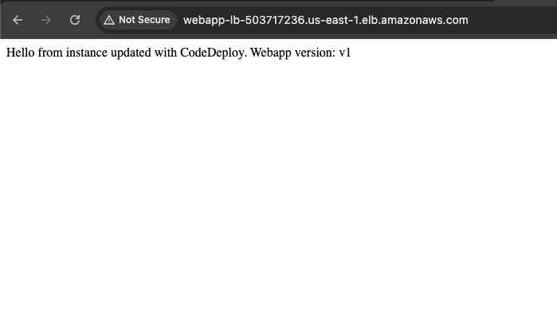
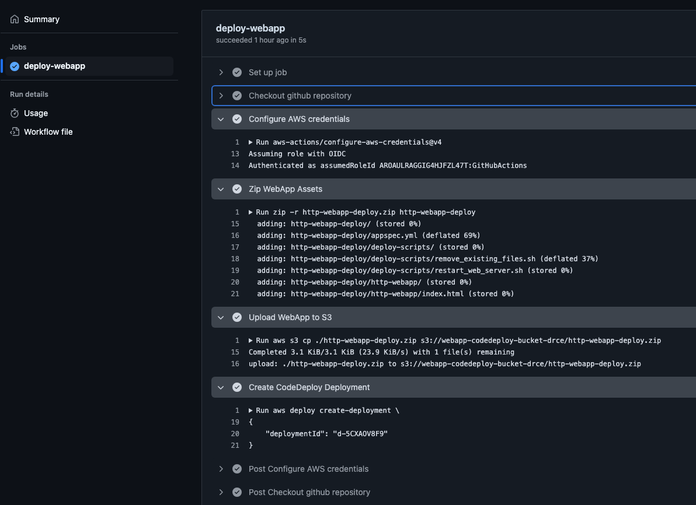
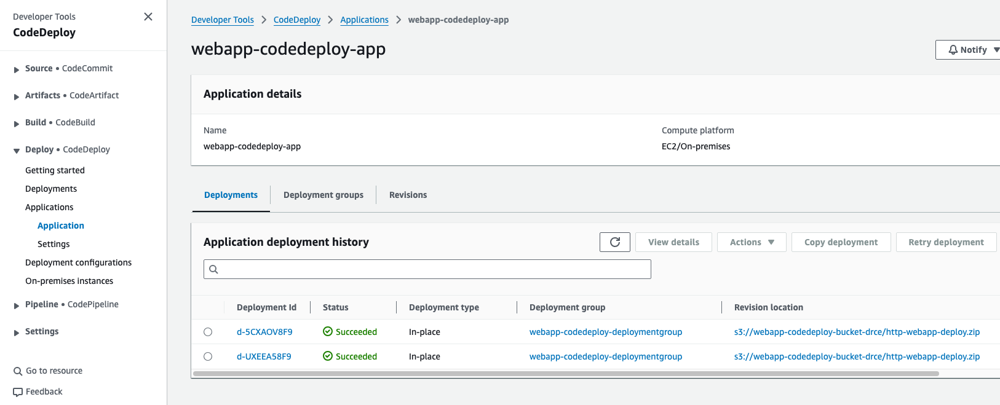
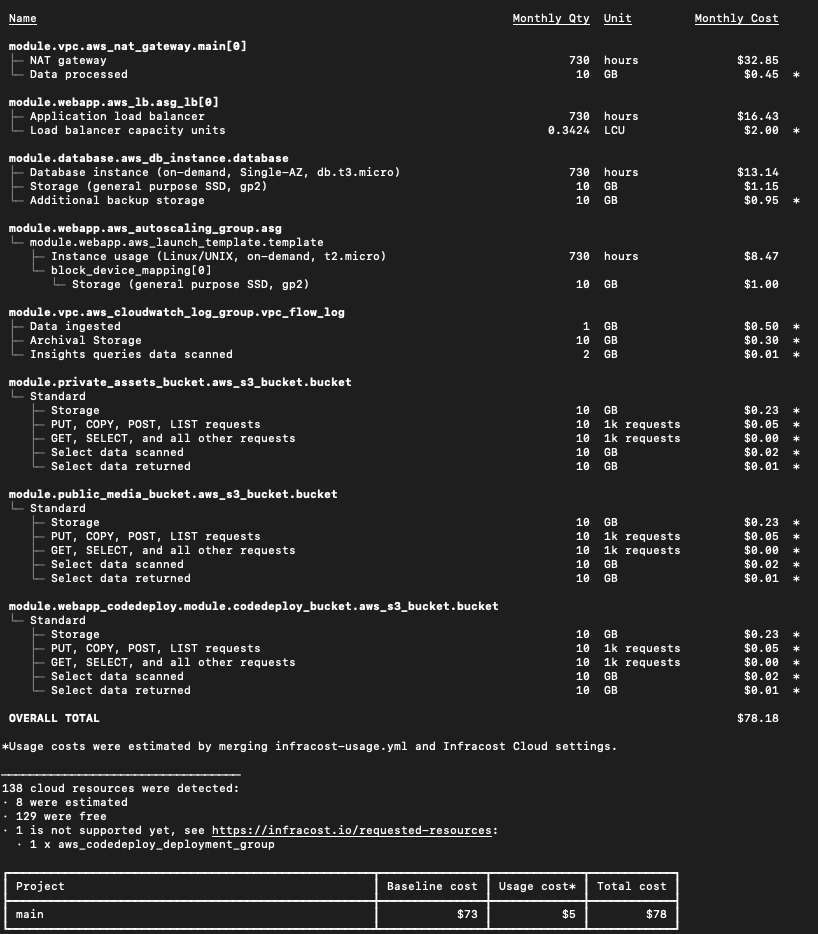

# Web App AWS EC2 Hosting - DEMO


This repository contains a DEMO solution architecture to host webapps using AWS EC2 virtual machines. Often, organisations need to migrate existing webapps from on-premise solution to AWS using a lift-and-shift methodology, that is, from an existing on-premises virtual machine solutions.



The solution architecture is built on AWS and uses the AWS services displayed in the diagram above.

The following sections describe:
- **Terraform Blueprints/Components**: Our Terraform automation templates to deploy the solution architecture.
- **GitHub Action workflows**: Our GitHub Actions workflows to deploy the lint Terraform assets and to deploy an example webapp to AWS.
- **Tutorial**: Step-by-step guide to deploy the solution architecture and and webapp using Terraform and GitHub Actions CI/CD pipeline.
- **Pre-commit hooks**: Pre-commit hooks to lint and check quality of Terraform assets.
- **Cost Estimation**: Cost estimation of the solution architecture using Infracost.
- **Troubleshooting**: Common issues and resolutions during the deployment of the solution architecture.

## Terraform Blueprints/Components

We use Terraform to automatically deploy the solution architecture. The Terraform blueprints are located in the `live-sandbox` folder. **The Terraform blueprints are Terraform use-case specific files that references Terraform components.** For our use case, we are defining Terraform blueprints to deploy a end-to-end solution architecture for Ingesting, processing, and visualizing streaming data from OpenAQ API.

Terraform components are located in the `terraform-components` folder. **The Terraform components are reusable Terraform code that can be used to deploy a specific AWS resource.** Terraform components not only deploys its specific AWS resource, but deploys them considering best practices regarding reusability, security, and scalability.

For more info on Terraform, please refer to the [Terraform documentation](https://www.terraform.io/docs/language/index.html).

## GitHub Action Workflows

The following workflows are implemented in this repository:
1. **terraform-ci**: This workflow is responsible for linting the Terraform assets using GitHub Actions. It triggers on pull request to the repository. It ensures that the Terraform assets is consistent, validated, and secure.
2. **webapp-cicd**: This workflow is responsible for deploying an example web application located in folder `http-webapp-deploy` using GitHub Actions. It triggers on pull request to the repository. The workflow performs the necessary steps to zip and deploy the web application to AWS.

## Tutorial

Please follow the below tutorials to deploy the solution architecture in the previous section:

1. Set up Terraform with AWS Cloud account
2. Deploy our AWS Infrastructure
3. Use GitHub Actions workflow to deploy a webapp version

### 1. Set up Terraform with AWS Cloud account

The following tools are required to deploy the solution architecture using Terraform. Please ensure you have the following tools available on your local machine:
- [AWS account](https://aws.amazon.com/): You need to have an AWS account to deploy resources on AWS.
- [Terraform](https://learn.hashicorp.com/tutorials/terraform/install-cli): You need to have Terraform installed on your local machine to deploy the Terraform blueprints.
- [AWS CLI](https://docs.aws.amazon.com/cli/latest/userguide/cli-chap-install.html): Optional, You need to have the AWS CLI installed on your local machine for viewing and updating AWS resources programmatically.

Follow the below steps to configure local Terraform with your AWS account:

**Step 1.** Configure Terraform to use your AWS access key, secret key, and session token by copy-pasting your AWS access and secret key in a Terminal:

```bash
export AWS_ACCESS_KEY_ID="xxx"
export AWS_SECRET_ACCESS_KEY="xxx"
export AWS_SESSION_TOKEN="xxx"
```

**Step 2.** Change directory to `live-sandbox` that contains Terraform blueprints. Setup up and validate the Terraform blueprints by running the below commands:

```bash
cd live-sandbox
terraform init
terraform validate
```

> **Remark:** In a multi-engineer environment, it is recommended to store Terraform state files in a remote backend, such as AWS S3, to allow multiple engineers to work on the same Terraform codebase. For more info on Terraform backends, please refer to the [Terraform documentation](https://www.terraform.io/docs/language/settings/backends/index.html).

### 2. Deploy our AWS Infrastructure

To deploy above solution architecture using Terraform,

**Step 1.** Change directory to live-sandbox that contains Terraform blueprints to deploy the solution architecture by running the below commands:

```bash
cd live-sandbox
terraform apply
```

**Step 2.** Confirm the Terraform resources to deploy in your AWS account, confirm by typing `yes` in the Terminal.

#### Destroy the AWS infrastructure

To destroy the AWS infrastructure deployed using Terraform, run the below command:

```bash
terraform destroy
```

Confirm the Terraform resources to destroy in your AWS account, confirm by typing `yes` in the Terminal.

### 3. Use GitHub Actions workflow to deploy a webapp version

To deploy a webapp version via Actions workflow,

**Step 1.** Fork this repository to play with the GitHub Actions workflow.

**Step 2.** Update the GitHub Actions workflow file in `.github/workflows/webapp-cicd.yml` with the deployed AWS CodeDeploy resources in the previous section. For example,
```yml
AWS_ROLE_TO_ASSUME: arn:aws:iam::299641483789:role/webapp-codedeploy-github-role
AWS_REGION: us-east-1
WEBAPP_DEPLOYMENT_FOLDER: http-webapp-deploy
CODEDEPLOY_S3_BUCKET_NAME: webapp-codedeploy-bucket-drce
CODEDEPLOY_APPLICATION_NAME: webapp-codedeploy-app
CODEDEPLOY_DEPLOYMENT_GROUP_NAME: webapp-codedeploy-deploymentgroup
```

**Step 3.** Make a new branch from your forked repository.

**Step 4.** Make a Pull Request in GitHub to see the GitHub Actions workflow `webapp-cicd` in action.

In GitHub Actions, you will see the different steps of the GitHub Actions workflow:


In AWS CodeDeploy service, you will see that the webapp will be deployed to the EC2 instances using CodeDeploy:


In your web browser, you can observe the result of the deployment via the load balancer DNS name:


**Step 5.** Make a change to the example web application file `http-webapp-deploy/http-webapp/index.html`. For example,
```html
Hello from instance updated with CodeDeploy. Webapp version: v1 -> v2
```

**Step 6.** Commit the change to GitHub and observe the changes all the way through to the load balancer DNS.

## Pre-commit hooks

This repository includes a set of pre-commit hooks to ensure code quality and maintainability before committing changes. These hooks help catch common errors and enforce coding standards in Terraform.

The set of hooks specified in `.pre-commit-config.yaml` and are summarized here:
- [TFLint](https://github.com/terraform-linters/tflint)
- [Trivy](https://aquasecurity.github.io/trivy/v0.45/getting-started/installation/)
- [terraform-docs](https://github.com/terraform-docs/terraform-docs)

Ensure all these Terraform tools are installed before contributing to this repository.

To set up pre-commit in a Conda environment, run the following commands:
```bash
make conda-setup
conda activate pre-commit
```

To set up pre-commit hooks, run the following commands:

```bash
make setup-pre-commit
```

To run pre-commit hooks on all files, run the following commands:

```bash
make run-pre-commit-all
```

## Cost Estimation

The cost estimation of the solution architecture is based on the AWS services used in the solution architecture. The cost estimation is based using **Infracost**, a cost estimation tool that estimates the cost of Terraform resources before deployment.

To estimate the cost of the solution architecture before deployment, follow the below steps:

**Step 1.** Install Infracost and obtain an API key by following the instructions in the [Infracost documentation](https://www.infracost.io/docs/).

**Step 2.** Change directory to `live-sandbox` that contains Terraform blueprints. Run the below command to estimate the cost of the solution architecture:

```bash
cd ./live-sandbox
infracost breakdown --show-skipped --usage-file infracost-usage.yml --path .
```

> **Remark**: The command uses the `infracost-usage.yml` file to estimate the usage costs of the solution architecture, which has been estimated carefully, but not guaranteed to be accurate.

The cost estimation of the solution architecture is displayed in the Terminal:



## Troubleshooting

Nothing to troubleshoot at the moment.
