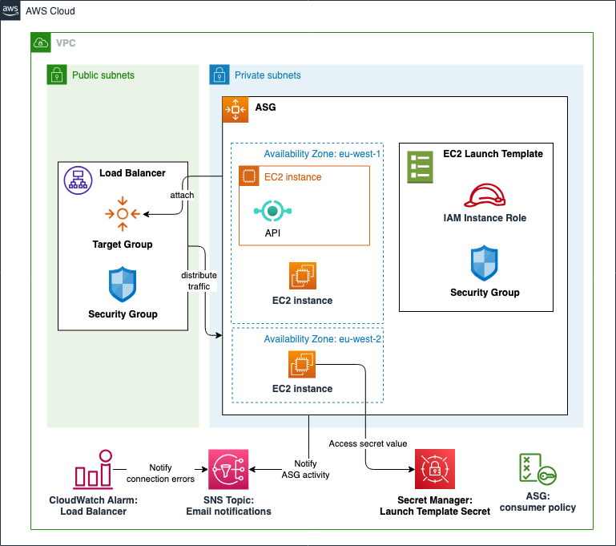

# AWS Application Scale Group

AWS Application Scale Group (ASG) contains a collection of EC2 instances that are treated as a logical grouping for the purposes of automatic scaling and management. An Auto Scaling group also lets you use Amazon EC2 Auto Scaling features such as health check replacements and scaling policies. Both maintaining the number of instances in an Auto Scaling group and automatic scaling are the core functionality of the Amazon EC2 Auto Scaling service.

This module creates:

- **ASG**: To automatically adjust the number of instances in the group based on the demand
- **ASG consumer policy**: This policy is created for the consumers of the ASG. It can be directly attached to all the consumers which will give them required permissions to access this ASG. *We do not recommend consumers creating ASG access policy on their own*.
- **Launch Template**: To define the instance configuration and launch settings for the Auto Scaling Group
- **Launch Template Security Group**: To control inbound and outbound traffic to the instances in the Auto Scaling Group
- **Launch Template IAM Instance Role**: Role that every instance in the Auto Scaling Group assumes.
- **Launch Template Secret**: Optional, a secret that the IAM instance role can use to access sensitive information in EC2.
- **Application/Network Load Balancer**: To distribute incoming traffic across multiple instances in the Auto Scaling Group
- **Target Group**: To route traffic from the Load Balancer to the instances based on the health check status.
- **Listener Rule**: To route traffic from the Load Balancer to the instances based on the host or path condition
- **Load Balancer Security Group**: To control inbound and outbound traffic to the load balancer of the Auto Scaling Group
- **Load Balancer CloudWatch Alarm**: Optional, A CloudWatch Alarm to monitor the health of the load balancer and trigger an SNS topic if the alarm is activated.

## Architecture



## Implementation decisions

### Dynamic Target Tracking Scaling Policy

The module allows users to enable dynamic scaling for the Auto Scaling Group. This feature automatically adjusts the number of instances in the group based on the demand. The scaling policy is based on a predefined metric type and target value.

### Launch Template Instance Profile and Role

The module creates an IAM instance profile and role with any user-specified policy arn attached and associates it to the launch template of the ASG.

Additionally, the IAM role is associated with the `AmazonSSMManagedInstanceCore` policy to allow the instances to communicate with the Session Manager service. This enables Session Manager Connect to allow users to connect to instances in the Auto Scaling Group using the EC2 console. This is useful for scenarios where you want to provide users with a browser-based SSH experience without exposing the instances to the internet.

Additionally, ensure that the instances have outbound internet access to connect to the Session Manager service. This can be achieved by deploying the instances in private subnets with a NAT Gateway reference in its route table.

For more information on Session Manager Connect, refer to the [AWS documentation](https://docs.aws.amazon.com/systems-manager/latest/userguide/getting-started-add-permissions-to-existing-profile.html).

### Launch Template Secret

This module allows users to specify a list of secrets that can be stored as a secret in the AWS Secrets Manager. This secret is accessible via the IAM role of the Launch Template.

This is useful for scenarios where you want to store sensitive information such as database passwords, API keys, and so on.

### Launch Template User Data

The module allows users to specify a user data script to be executed when the instances are launched. The user data script can be used to install software packages, configure the instance, and so on.

### Load Balancer

The module creates an Application/Network Load Balancer to distribute incoming traffic across multiple instances in the Auto Scaling Group.

Using the Terraform resource `aws_autoscaling_attachment`, the module attaches the instances in the Auto Scaling Group to the target group of the Application/Network Load Balancer. This allows the Application/Network Load Balancer to route traffic to the instances based on the health check status.

Additionally, the Application Scale Group must enable the ELB health check feature to allow the Application/Network Load Balancer to monitor the health of the instances, using the `health_check_type = "ELB"` block in the `aws_autoscaling_group` resource.

### Security Groups

The module creates security groups for the Load Balancer and the Launch Template.

The Load Balancer security group is created with the following rules:

- Inbound: Allow traffic from the Launch Template security group (itself) on all protocols and ports.
- Inbound: Allow traffic from Load Balancer security group on TCP protocol and the port of the Load Balancer.
- Outbound: Allow all protocols and ports outbound.

The Launch Template security group is created with the following rules:

- Inbound: Allow traffic from the Launch Template security group (itself) on all protocols and ports.
- Inbound: If the Load Balancer is external-facing, allow traffic from the internet on TCP protocol and the port of the Load Balancer.
- Outbound: Allow all protocols and ports outbound.

### CloudWatch Alarms and notifications

This module can optionally create notifications for the Application Sclae Group (ASG) and an CloudWatch Alarm for monitoring the health of the ASG Load Balancer. We implemented the following notifications and alarms:

- **ASG Notification**: The module creates an SNS topic to send notifications for the ASG for the following types: `autoscaling:EC2_INSTANCE_LAUNCH`, `autoscaling:EC2_INSTANCE_TERMINATE`, `autoscaling:EC2_INSTANCE_LAUNCH_ERROR`, `autoscaling:EC2_INSTANCE_TERMINATE_ERROR`.
- **ASG Load Balancer Alarms**: The module creates a CloudWatch Alarm to monitor if the target connection errors are greater than 1. If the alarm is triggered, it will send a notification to an SNS topic.

## How to use this module

```terraform
module "webapp" {
  source = "path/to/aws-asg"

  ### Application Auto Scaling Group
  asg_info = {
    name                  = local.webapp_name
    min_size_unit         = 1
    max_size_unit         = 1
    desired_capacity_unit = 1
    subnet_ids            = module.vpc.private_subnets_ids["application"]
  }

  dynamic_scaling_info = {
    estimated_instance_warmup_time_seconds = 300
    enabled                                = true
    predefined_metric_type                 = "ASGAverageCPUUtilization"
    target_value                           = 50.0
    disable_scale_in                       = false
  }

  launch_template_info = {
    name          = local.webapp_name
    image_id      = local.ami_nodejs_id
    instance_type = "t3.small"
    vpc_id        = module.vpc.vpc_id
    instance_role_policy_arns = {
      rds_consumer           = module.webapp_database.consumer_policy_arn,
      codedeploy_s3_consumer = module.webapp_codedeploy.s3_bucket_consumer_policy_arn,
    }
    block_volume_size = 10
    user_data_path    = "${path.root}/templates/covered-bond-label-setup.sh"
  }

  launch_template_secrets = {
    "RDS_INSTANCE_IDENTIFIER"    = module.webapp_database.rds_name,
    "RDS_CREDENTIALS_SECRET_ARN" = module.webapp_database.master_password_secret_arn,
  }

  ### ASG Load Balancer
  deploy_asg_lb = true
  asg_lb_info = {
    lb_type               = "application"
    internal_lb           = false
    service_port          = 80
    lb_access_logs_bucket = ""
    vpc_id                = module.vpc.vpc_id
    subnet_ids            = module.vpc.public_subnets_ids
  }

  asg_alb_rule_path_based_routing = {
    priority = "100"
    value    = ""
  }

  asg_lb_health_check = {
    interval            = 30
    timeout             = 20
    healthy_threshold   = 3
    unhealthy_threshold = 3
    path                = "/healthz"
    matcher             = "200,201,204"
  }

  ### Monitorng
  enable_asg_lb_alarms        = true
  asg_lb_alarms_sns_topic_arn = aws_sns_topic.sns_topic.arn

  ### Metadata
  tags = local.tags
}
```

<!-- BEGIN_TF_DOCS -->
## Requirements

| Name | Version |
|------|---------|
| <a name="requirement_terraform"></a> [terraform](#requirement\_terraform) | ~> 1.9.0 |
| <a name="requirement_aws"></a> [aws](#requirement\_aws) | ~> 5.75.0 |
| <a name="requirement_random"></a> [random](#requirement\_random) | ~> 3.6.0 |

## Providers

| Name | Version |
|------|---------|
| <a name="provider_aws"></a> [aws](#provider\_aws) | 5.75.0 |
| <a name="provider_random"></a> [random](#provider\_random) | 3.6.3 |

## Modules

| Name | Source | Version |
|------|--------|---------|
| <a name="module_asg_launch_template_sg"></a> [asg\_launch\_template\_sg](#module\_asg\_launch\_template\_sg) | ../aws-sg | n/a |
| <a name="module_asg_lb_sg"></a> [asg\_lb\_sg](#module\_asg\_lb\_sg) | ../aws-sg | n/a |

## Resources

| Name | Type |
|------|------|
| [aws_autoscaling_attachment.asg_lb](https://registry.terraform.io/providers/hashicorp/aws/latest/docs/resources/autoscaling_attachment) | resource |
| [aws_autoscaling_group.asg](https://registry.terraform.io/providers/hashicorp/aws/latest/docs/resources/autoscaling_group) | resource |
| [aws_autoscaling_notification.asg_notification](https://registry.terraform.io/providers/hashicorp/aws/latest/docs/resources/autoscaling_notification) | resource |
| [aws_autoscaling_policy.target_tracking_scaling_policy](https://registry.terraform.io/providers/hashicorp/aws/latest/docs/resources/autoscaling_policy) | resource |
| [aws_cloudwatch_metric_alarm.target_connection_errors_alarm](https://registry.terraform.io/providers/hashicorp/aws/latest/docs/resources/cloudwatch_metric_alarm) | resource |
| [aws_iam_instance_profile.launch_template](https://registry.terraform.io/providers/hashicorp/aws/latest/docs/resources/iam_instance_profile) | resource |
| [aws_iam_policy.asg_consumer](https://registry.terraform.io/providers/hashicorp/aws/latest/docs/resources/iam_policy) | resource |
| [aws_iam_policy.launch_template_get_secret](https://registry.terraform.io/providers/hashicorp/aws/latest/docs/resources/iam_policy) | resource |
| [aws_iam_role.launch_template](https://registry.terraform.io/providers/hashicorp/aws/latest/docs/resources/iam_role) | resource |
| [aws_iam_role_policy_attachment.launch_template_get_secret](https://registry.terraform.io/providers/hashicorp/aws/latest/docs/resources/iam_role_policy_attachment) | resource |
| [aws_iam_role_policy_attachment.launch_template_role](https://registry.terraform.io/providers/hashicorp/aws/latest/docs/resources/iam_role_policy_attachment) | resource |
| [aws_iam_role_policy_attachment.launch_template_role_ssm](https://registry.terraform.io/providers/hashicorp/aws/latest/docs/resources/iam_role_policy_attachment) | resource |
| [aws_launch_template.template](https://registry.terraform.io/providers/hashicorp/aws/latest/docs/resources/launch_template) | resource |
| [aws_lb.asg_lb](https://registry.terraform.io/providers/hashicorp/aws/latest/docs/resources/lb) | resource |
| [aws_lb_listener.alb_listener](https://registry.terraform.io/providers/hashicorp/aws/latest/docs/resources/lb_listener) | resource |
| [aws_lb_listener.nlb_listener](https://registry.terraform.io/providers/hashicorp/aws/latest/docs/resources/lb_listener) | resource |
| [aws_lb_listener_rule.alb_host_based_listener](https://registry.terraform.io/providers/hashicorp/aws/latest/docs/resources/lb_listener_rule) | resource |
| [aws_lb_listener_rule.alb_path_based_listener](https://registry.terraform.io/providers/hashicorp/aws/latest/docs/resources/lb_listener_rule) | resource |
| [aws_lb_target_group.asg_lb](https://registry.terraform.io/providers/hashicorp/aws/latest/docs/resources/lb_target_group) | resource |
| [aws_secretsmanager_secret.launch_template_secret](https://registry.terraform.io/providers/hashicorp/aws/latest/docs/resources/secretsmanager_secret) | resource |
| [aws_secretsmanager_secret_version.asg_secret](https://registry.terraform.io/providers/hashicorp/aws/latest/docs/resources/secretsmanager_secret_version) | resource |
| [random_string.service_secret_random_suffix](https://registry.terraform.io/providers/hashicorp/random/latest/docs/resources/string) | resource |
| [aws_ami.latest](https://registry.terraform.io/providers/hashicorp/aws/latest/docs/data-sources/ami) | data source |
| [aws_iam_policy_document.asg_consumer](https://registry.terraform.io/providers/hashicorp/aws/latest/docs/data-sources/iam_policy_document) | data source |
| [aws_iam_policy_document.launch_template_get_secret](https://registry.terraform.io/providers/hashicorp/aws/latest/docs/data-sources/iam_policy_document) | data source |

## Inputs

| Name | Description | Type | Default | Required |
|------|-------------|------|---------|:--------:|
| <a name="input_asg_alb_custom_header_token"></a> [asg\_alb\_custom\_header\_token](#input\_asg\_alb\_custom\_header\_token) | Specify secret value for custom header that will be added to lb listener rules | `string` | `null` | no |
| <a name="input_asg_alb_rule_host_based_routing"></a> [asg\_alb\_rule\_host\_based\_routing](#input\_asg\_alb\_rule\_host\_based\_routing) | [Optional] Mention host For ALB routing eg: some\_host, specify one of host based or path based is needed for ALB listener when attach\_alb is enable | <pre>object({<br/>    priority = string<br/>    value    = string<br/>  })</pre> | <pre>{<br/>  "priority": "100",<br/>  "value": null<br/>}</pre> | no |
| <a name="input_asg_alb_rule_path_based_routing"></a> [asg\_alb\_rule\_path\_based\_routing](#input\_asg\_alb\_rule\_path\_based\_routing) | Mention Path For ALB routing eg: / or /route1, specify one of host based or path based is needed for ALB listener when attach\_alb is enable | <pre>object({<br/>    priority = string<br/>    value    = string<br/>  })</pre> | <pre>{<br/>  "priority": "100",<br/>  "value": null<br/>}</pre> | no |
| <a name="input_asg_allowed_actions"></a> [asg\_allowed\_actions](#input\_asg\_allowed\_actions) | List of ASG actions which are allowed for same account principals for the consumer policy | `list(string)` | <pre>[<br/>  "autoscaling:DescribeAutoScalingGroups"<br/>]</pre> | no |
| <a name="input_asg_info"></a> [asg\_info](#input\_asg\_info) | The info block for the application scale group to deploy. | <pre>object({<br/>    name                  = string<br/>    min_size_unit         = number<br/>    max_size_unit         = number<br/>    desired_capacity_unit = number<br/>    subnet_ids            = list(string)<br/><br/>  })</pre> | <pre>{<br/>  "desired_capacity_unit": 1,<br/>  "max_size_unit": 1,<br/>  "min_size_unit": 1,<br/>  "name": "webapp",<br/>  "subnet_ids": [<br/>    "subnet-123",<br/>    "subnet-abc"<br/>  ]<br/>}</pre> | no |
| <a name="input_asg_lb_health_check"></a> [asg\_lb\_health\_check](#input\_asg\_lb\_health\_check) | The health check block for the application scale group load balancer to deploy. | <pre>object({<br/>    interval            = number<br/>    healthy_threshold   = number<br/>    unhealthy_threshold = number<br/>    timeout             = number<br/>    path                = string<br/>    matcher             = string<br/>  })</pre> | <pre>{<br/>  "healthy_threshold": 2,<br/>  "interval": 30,<br/>  "matcher": "200",<br/>  "path": "/",<br/>  "timeout": 5,<br/>  "unhealthy_threshold": 2<br/>}</pre> | no |
| <a name="input_asg_lb_info"></a> [asg\_lb\_info](#input\_asg\_lb\_info) | The info block for the application scale group load balancer to deploy.<br/>If internal\_lb is true, then the subnet\_ids should be private subnets, else public subnets. | <pre>object({<br/>    lb_type               = string<br/>    internal_lb           = bool<br/>    service_port          = number<br/>    lb_access_logs_bucket = string<br/>    vpc_id                = string<br/>    subnet_ids            = list(string)<br/>  })</pre> | <pre>{<br/>  "internal_lb": false,<br/>  "lb_access_logs_bucket": "bucket-123",<br/>  "lb_type": "application",<br/>  "service_port": 80,<br/>  "subnet_ids": [<br/>    "subnet-123",<br/>    "subnet-abc"<br/>  ],<br/>  "vpc_id": "vpc-123"<br/>}</pre> | no |
| <a name="input_certificate_arn"></a> [certificate\_arn](#input\_certificate\_arn) | The ARN of the certificate to use for the load balancer | `string` | `""` | no |
| <a name="input_deploy_asg_lb"></a> [deploy\_asg\_lb](#input\_deploy\_asg\_lb) | Whether to deploy the ASG Load Balancer or not | `bool` | `false` | no |
| <a name="input_dynamic_scaling_info"></a> [dynamic\_scaling\_info](#input\_dynamic\_scaling\_info) | n/a | <pre>object({<br/>    estimated_instance_warmup_time_seconds = number<br/>    enabled                                = bool<br/>    predefined_metric_type                 = string<br/>    target_value                           = number<br/>    disable_scale_in                       = bool<br/>  })</pre> | <pre>{<br/>  "disable_scale_in": false,<br/>  "enabled": false,<br/>  "estimated_instance_warmup_time_seconds": 300,<br/>  "predefined_metric_type": "ASGAverageCPUUtilization",<br/>  "target_value": 50<br/>}</pre> | no |
| <a name="input_enable_monitoring"></a> [enable\_monitoring](#input\_enable\_monitoring) | Enable monitoring for the ASG and the ASG Load Balancer | `bool` | `false` | no |
| <a name="input_launch_template_info"></a> [launch\_template\_info](#input\_launch\_template\_info) | The info block for the launch template to deploy.<br/>For instance\_role\_policy\_arns to attach to the Launch Template EC2 Instance Role, use for example: { rds\_arn = module.postgres\_db.rds\_policy\_arn } | <pre>object({<br/>    name                      = string<br/>    image_id                  = string<br/>    instance_type             = string<br/>    vpc_id                    = string<br/>    instance_role_policy_arns = map(string)<br/>    block_volume_size         = number<br/>    user_data_path            = string<br/>  })</pre> | <pre>{<br/>  "block_volume_size": 10,<br/>  "image_id": "latest",<br/>  "instance_role_policy_arns": {<br/>    "rds_consumer": "arn:aws:iam::123456789012:policy/MyRDSConsumerPolicy",<br/>    "s3_consumer": "arn:aws:iam::123456789012:policy/MyS3ConsumerPolicy"<br/>  },<br/>  "instance_type": "t2.micro",<br/>  "name": "webapp",<br/>  "user_data_path": "user-data/http-example-simple.sh",<br/>  "vpc_id": "vpc-123"<br/>}</pre> | no |
| <a name="input_launch_template_secrets"></a> [launch\_template\_secrets](#input\_launch\_template\_secrets) | Map of secret name (as reflected in Secrets Manager) and secret JSON string associated that can be accessed by the EC2 instances of the launch template. | `map(string)` | `{}` | no |
| <a name="input_monitoring_sns_topic_arn"></a> [monitoring\_sns\_topic\_arn](#input\_monitoring\_sns\_topic\_arn) | The ARN of the SNS topic to which the monitoring for the ASG will be sent | `string` | `""` | no |
| <a name="input_tags"></a> [tags](#input\_tags) | Tags which can be passed on to the AWS resources. They should be key value pairs having distinct keys | `map(string)` | `{}` | no |

## Outputs

| Name | Description |
|------|-------------|
| <a name="output_asg_arn"></a> [asg\_arn](#output\_asg\_arn) | The ARN of the Auto Scaling group |
| <a name="output_asg_consumer_policy_arn"></a> [asg\_consumer\_policy\_arn](#output\_asg\_consumer\_policy\_arn) | The Amazon Resource Name (ARN) of the IAM policy for the ASG consumer. |
| <a name="output_asg_lb_arn"></a> [asg\_lb\_arn](#output\_asg\_lb\_arn) | The ARN of the load balancer of the ASG |
| <a name="output_asg_lb_name"></a> [asg\_lb\_name](#output\_asg\_lb\_name) | The name of the load balancer of the ASG |
| <a name="output_asg_lb_sg_id"></a> [asg\_lb\_sg\_id](#output\_asg\_lb\_sg\_id) | The ID of the security group of the load balancer of the ASG |
| <a name="output_asg_lb_tg_arn"></a> [asg\_lb\_tg\_arn](#output\_asg\_lb\_tg\_arn) | The ARN of the target group of the load balancer of the ASG |
| <a name="output_asg_lb_tg_name"></a> [asg\_lb\_tg\_name](#output\_asg\_lb\_tg\_name) | The name of the target group of the load balancer of the ASG |
| <a name="output_asg_name"></a> [asg\_name](#output\_asg\_name) | The name of the Auto Scaling group |
| <a name="output_launch_template_iam_instance_profile_id"></a> [launch\_template\_iam\_instance\_profile\_id](#output\_launch\_template\_iam\_instance\_profile\_id) | The ID of the IAM instance profile of the launch template |
| <a name="output_launch_template_iam_instance_profile_name"></a> [launch\_template\_iam\_instance\_profile\_name](#output\_launch\_template\_iam\_instance\_profile\_name) | The name of the IAM instance profile of the launch template |
| <a name="output_launch_template_iam_role_id"></a> [launch\_template\_iam\_role\_id](#output\_launch\_template\_iam\_role\_id) | The ID of the IAM role of the launch template |
| <a name="output_launch_template_iam_role_name"></a> [launch\_template\_iam\_role\_name](#output\_launch\_template\_iam\_role\_name) | The name of the IAM role of the launch template |
| <a name="output_launch_template_id"></a> [launch\_template\_id](#output\_launch\_template\_id) | The ID of the launch template |
| <a name="output_launch_template_name"></a> [launch\_template\_name](#output\_launch\_template\_name) | The name of the launch template |
| <a name="output_launch_template_sg_id"></a> [launch\_template\_sg\_id](#output\_launch\_template\_sg\_id) | The ID of the security group of the launch template |
| <a name="output_secret_arn"></a> [secret\_arn](#output\_secret\_arn) | The ARN of the secret |
| <a name="output_secret_name"></a> [secret\_name](#output\_secret\_name) | The name of the secret |
<!-- END_TF_DOCS -->
