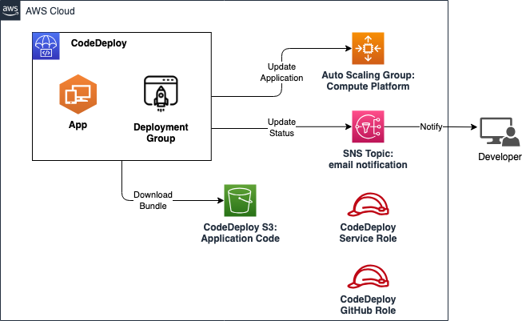

# AWS CodeDeploy

CodeDeploy is an AWS deployment service that automates application deployments to Amazon EC2 instances, on-premises instances, serverless Lambda functions, or Amazon ECS services.

This module creates:

- **CodeDeploy App:** A CodeDeploy application is simply a name or container used by CodeDeploy to ensure that the correct revision, deployment configuration, and deployment group are referenced during a deployment.
- **CodeDeploy Deployment Group:** The deployment group contains settings and configurations used during the deployment. Most deployment group settings depend on the compute platform used by your application. Some settings, such as rollbacks, triggers, and alarms can be configured for deployment groups for any compute platform.
- **CodeDeploy Service Role:** The service role is used by CodeDeploy to perform actions on your behalf. The service role you create for CodeDeploy must be granted the permissions required for your compute platform.
- **CodeDeploy S3 Bucket:** An S3 bucket is created to store the application code that will be deployed by CodeDeploy.
- **GitHub OIDC Identity Provider Trust Setup:** Optional, To set up a trusted relation with between the AWS Account and GitHub Actions OIDC.
- **CodeDeploy GitHub Role** Optional, To set up a GitHub role to be used in GitHub to do CI/CD actions.

## Architecture



## Implementation decisions

### Compute Platform

**This module is designed to only work with In-Place Application Scale Group deployments at the moment.** The deployment group created by this module should be associated with an autoscaling group. The deployment group is configured to deploy applications to the instances in the autoscaling group.

### CodeDeploy Service Role

This module creates a service role for CodeDeploy. The role is created with the following permissions:

- **AWSCodeDeployRole**: A built-in policy that grants the necessary permissions to CodeDeploy to perform actions for EC2/On-Premises deployments. For other compute platforms, you may need to attach another policy to the role.

### Notification (optional)

This module can optionally enable notifications for the deployment group. If enabled, an user-specified SNS topic will be used to send notifications about the deployment group.

### GitHub OIDC (optional)

OpenID Connect (OIDC) allows your GitHub Actions workflows to access resources in Amazon Web Services (AWS), without needing to store the AWS credentials as long-lived GitHub secrets.

This module can optionally enable a trusted connection with between the AWS Account and GitHub Actions OIDC.

Furthermore, this module creates an IAM role that can be assumed using the `aws-actions/configure-aws-credentials` GitHub Actions workflow.

For more info, please visit [GitHub Documentation](https://docs.github.com/en/actions/security-for-github-actions/security-hardening-your-deployments/configuring-openid-connect-in-amazon-web-services) and [AWS Documentation](https://docs.aws.amazon.com/IAM/latest/UserGuide/id_roles_create_for-idp_oidc.html#idp_oidc_Create_GitHub)

## Deployment example

In the folder `http-deploy-example` you can find an example of how to organise your application to be compatible with the AWS CodeDeploy service. The example contains:

- `appspec.yml`: This file is used by CodeDeploy to know how to deploy your application. It contains the instructions to copy application code and run scripts during the different deployment lifecycle events, etc.
- `deploy-scripts`: This folder contains the scripts that will be executed during the different deployment lifecycle events. The scripts are written in bash and are executed in the order specified in the `appspec.yml` file.
- `http-webapp-test/index.html`: This is a simple HTML file that will be used for deployment using the CodeDeploy service.

A new deployment can be initiated in the AWS Console on the deployed CodeDeploy Deployment Group. To deploy the example application, you can create a new deployment and specify the S3 bucket and object key where the application code is stored:

**Step 1:** Go to the CodeDeploy Consle and select the CodeDeploy app created by this module.

**Step 2:** Under the _Deployments_ tab, select _Create deployment_.

**Step 3:** Specify the deployment group created by this module and the revision location on S3. Select _Create deployment_.

> **Remark:** Make sure your compute platform can access the S3 bucket where the application code is stored.

> **Remark:** All new instances launched by the autoscaling group will automatically be registered with the deployment group. The deployment group will deploy the application to the instances using the revision specified in the deployment above.

> **Remark:** In a DevOps setup, the above steps could be automated in a CI/CD setup such as GitHub Actions.

## How to use this module

```terraform
module "webapp-codedeploy" {
  source = "../terraform-modules/aws-codedeploy"

  service_name              = "webapp"
  autoscaling_groups_names  = [module.webapp.asg_name]
  update_outdated_instances = true
  target_group_name         = module.webapp.asg_lb_tg_name

  enable_notifications         = true
  notifications_sns_topic_arn  = aws_sns_topic.sns_topic.arn

  tags = local.tags
}
```

<!-- BEGIN_TF_DOCS -->
## Requirements

| Name | Version |
|------|---------|
| <a name="requirement_terraform"></a> [terraform](#requirement\_terraform) | >= 1.1.3 |
| <a name="requirement_aws"></a> [aws](#requirement\_aws) | ~> 5.45.0 |

## Providers

| Name | Version |
|------|---------|
| <a name="provider_aws"></a> [aws](#provider\_aws) | 5.45.0 |

## Modules

| Name | Source | Version |
|------|--------|---------|
| <a name="module_codedeploy_bucket"></a> [codedeploy\_bucket](#module\_codedeploy\_bucket) | ../aws-s3bucket | n/a |

## Resources

| Name | Type |
|------|------|
| [aws_codedeploy_app.app](https://registry.terraform.io/providers/hashicorp/aws/latest/docs/resources/codedeploy_app) | resource |
| [aws_codedeploy_deployment_group.group](https://registry.terraform.io/providers/hashicorp/aws/latest/docs/resources/codedeploy_deployment_group) | resource |
| [aws_iam_role.codedeploy_service_role](https://registry.terraform.io/providers/hashicorp/aws/latest/docs/resources/iam_role) | resource |
| [aws_iam_role_policy_attachment.AWSCodeDeployRole](https://registry.terraform.io/providers/hashicorp/aws/latest/docs/resources/iam_role_policy_attachment) | resource |
| [aws_iam_policy_document.assume_role](https://registry.terraform.io/providers/hashicorp/aws/latest/docs/data-sources/iam_policy_document) | data source |

## Inputs

| Name | Description | Type | Default | Required |
|------|-------------|------|---------|:--------:|
| <a name="input_autoscaling_groups_names"></a> [autoscaling\_groups\_names](#input\_autoscaling\_groups\_names) | The names of the autoscaling groups to which the deployment group will be associated | `list(string)` | n/a | yes |
| <a name="input_enable_notifications"></a> [enable\_notifications](#input\_enable\_notifications) | Enable notifications for the deployment group | `bool` | `false` | no |
| <a name="input_notifications_sns_topic_arn"></a> [notifications\_sns\_topic\_arn](#input\_notifications\_sns\_topic\_arn) | The ARN of the SNS topic to which the notifications of the deployments will be sent | `string` | `""` | no |
| <a name="input_service_name"></a> [service\_name](#input\_service\_name) | The name of the service for which code deploy mechanisms is being created | `string` | n/a | yes |
| <a name="input_tags"></a> [tags](#input\_tags) | Tags which can be passed on to the AWS resources. They should be key value pairs having distinct keys | `map(string)` | `{}` | no |
| <a name="input_target_group_name"></a> [target\_group\_name](#input\_target\_group\_name) | The name of the target group to which the instances will be deregistered during deployment. This avoids serving traffic during deployment, but slows down deployment. | `string` | `null` | no |
| <a name="input_update_outdated_instances"></a> [update\_outdated\_instances](#input\_update\_outdated\_instances) | Update EC2 instances that are launched mid-deployment during deployment | `bool` | `false` | no |

## Outputs

| Name | Description |
|------|-------------|
| <a name="output_app_arn"></a> [app\_arn](#output\_app\_arn) | The ARN of the code deploy app |
| <a name="output_app_id"></a> [app\_id](#output\_app\_id) | The ID of the code deploy app |
| <a name="output_app_name"></a> [app\_name](#output\_app\_name) | The name of the code deploy app |
| <a name="output_deployment_group_arn"></a> [deployment\_group\_arn](#output\_deployment\_group\_arn) | The ARN of the code deploy deployment group |
| <a name="output_deployment_group_id"></a> [deployment\_group\_id](#output\_deployment\_group\_id) | The ID of the code deploy deployment group |
| <a name="output_s3_bucket_arn"></a> [s3\_bucket\_arn](#output\_s3\_bucket\_arn) | The ARN of the S3 bucket |
| <a name="output_s3_bucket_consumer_policy_arn"></a> [s3\_bucket\_consumer\_policy\_arn](#output\_s3\_bucket\_consumer\_policy\_arn) | The ARN of the consumer policy for the S3 bucket |
| <a name="output_s3_bucket_id"></a> [s3\_bucket\_id](#output\_s3\_bucket\_id) | The ID of the S3 bucket |
| <a name="output_s3_bucket_name"></a> [s3\_bucket\_name](#output\_s3\_bucket\_name) | The name of the S3 bucket |
| <a name="output_service_role_arn"></a> [service\_role\_arn](#output\_service\_role\_arn) | The ARN of the code deploy service role |
| <a name="output_service_role_id"></a> [service\_role\_id](#output\_service\_role\_id) | The ID of the code deploy service role |
| <a name="output_service_role_name"></a> [service\_role\_name](#output\_service\_role\_name) | The name of the code deploy service role |
<!-- END_TF_DOCS -->
