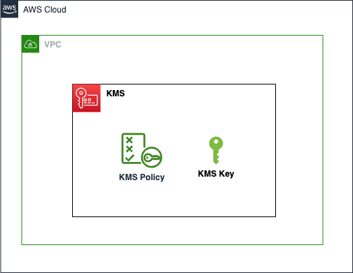

# AWS KMS Key

AWS Key Management Service (KMS) makes it easy for you to create and manage cryptographic keys and control their use across a wide range of AWS services and in your applications. This component creates a KMS key that is used to encrypt data across the platform.

This module creates:

- **KMS key**: Resource which creates the KMS key
- **KMS key policy**: Key policies which permits cross account access, access through AWS principles and AWS services based on some conditions and input variables

## Architecture



## Implementation decisions

We have two types of KMS keys for this module:

- **Direct Key**: This key is used for encrypting data that is not used by AWS services. The key policy allows access to the key only to the specified AWS principles.
- **Service Key**: This key is used for encrypting data that is used by AWS services. The key policy allows access to the key only to the specified AWS services.

The difference lies in the key policy. The key policy for the direct key allows access to the key only to the specified AWS principles. The key policy for the service key allows access to the key only to the specified AWS services.

## How to use this module

```terraform
module "kms_key" {
  source = "path/to/this/module/aws-kmskey"

  alias_name           = local.instance_managed_password_kmskey_name
  key_type             = "service"
  append_random_suffix = true
  description          = "RDS: KMS key that is used for encrypting the managed password of the database instance."
  tags                 = var.tags

  service_key_info = {
    caller_account_ids = [data.aws_caller_identity.current.account_id]
    aws_service_names  = ["rds.${data.aws_region.active.name}.amazonaws.com"]
  }
}
```

<!-- BEGIN_TF_DOCS -->
## Requirements

| Name | Version |
|------|---------|
| <a name="requirement_terraform"></a> [terraform](#requirement\_terraform) | ~> 1.9.0 |
| <a name="requirement_aws"></a> [aws](#requirement\_aws) | ~> 5.75.0 |
| <a name="requirement_random"></a> [random](#requirement\_random) | ~> 3.6.0 |

## Providers

| Name | Version |
|------|---------|
| <a name="provider_aws"></a> [aws](#provider\_aws) | 5.75.0 |
| <a name="provider_random"></a> [random](#provider\_random) | 3.6.3 |

## Modules

No modules.

## Resources

| Name | Type |
|------|------|
| [aws_kms_alias.key](https://registry.terraform.io/providers/hashicorp/aws/latest/docs/resources/kms_alias) | resource |
| [aws_kms_key.key](https://registry.terraform.io/providers/hashicorp/aws/latest/docs/resources/kms_key) | resource |
| [random_string.random_suffix](https://registry.terraform.io/providers/hashicorp/random/latest/docs/resources/string) | resource |
| [aws_caller_identity.current](https://registry.terraform.io/providers/hashicorp/aws/latest/docs/data-sources/caller_identity) | data source |
| [aws_iam_policy_document.kms_key_policy_direct](https://registry.terraform.io/providers/hashicorp/aws/latest/docs/data-sources/iam_policy_document) | data source |
| [aws_iam_policy_document.kms_key_policy_via_service](https://registry.terraform.io/providers/hashicorp/aws/latest/docs/data-sources/iam_policy_document) | data source |

## Inputs

| Name | Description | Type | Default | Required |
|------|-------------|------|---------|:--------:|
| <a name="input_alias_name"></a> [alias\_name](#input\_alias\_name) | Name for the kms key alias. A random string will be appended depending on the 'append\_random\_suffix' variable | `string` | n/a | yes |
| <a name="input_append_random_suffix"></a> [append\_random\_suffix](#input\_append\_random\_suffix) | Append a random string to the alias name. Default: true (yes) | `bool` | `true` | no |
| <a name="input_deletion_window"></a> [deletion\_window](#input\_deletion\_window) | Number of days before a key actually gets deleted once it's been scheduled for deletion. Valid value between 7 and 30 days | `number` | `30` | no |
| <a name="input_description"></a> [description](#input\_description) | The description to give to the key | `string` | n/a | yes |
| <a name="input_direct_key_principal"></a> [direct\_key\_principal](#input\_direct\_key\_principal) | Principal Information - Type & Identifier required for a 'direct' key | `map(list(string))` | <pre>{<br/>  "AWS": []<br/>}</pre> | no |
| <a name="input_key_type"></a> [key\_type](#input\_key\_type) | Indicate which kind of key to create: 'service' for key used by services; 'direct' for other keys. Must provide service\_key or direct\_key maps depending on the type | `string` | n/a | yes |
| <a name="input_kms_key_conditions"></a> [kms\_key\_conditions](#input\_kms\_key\_conditions) | [Optional] List of conditions to add to the KMS key Via-Service policy statement | <pre>set(object({<br/>    test     = string<br/>    variable = string<br/>    values   = list(string)<br/>  }))</pre> | `[]` | no |
| <a name="input_service_key_info"></a> [service\_key\_info](#input\_service\_key\_info) | Information required for a 'service' key | <pre>object({<br/>    # List of AWS service names for the kms:ViaService policy condition<br/>    aws_service_names = list(string)<br/>    # List of caller account IDs for the kms:CallerAccount policy condition<br/>    caller_account_ids = list(string)<br/>  })</pre> | <pre>{<br/>  "aws_service_names": [],<br/>  "caller_account_ids": []<br/>}</pre> | no |
| <a name="input_tags"></a> [tags](#input\_tags) | Tags which can be passed on to the AWS resources. They should be key value pairs having distinct keys | `map(string)` | `{}` | no |

## Outputs

| Name | Description |
|------|-------------|
| <a name="output_key_arn"></a> [key\_arn](#output\_key\_arn) | The ARN of the KMS key |
| <a name="output_key_id"></a> [key\_id](#output\_key\_id) | The ID of the KMS key |
<!-- END_TF_DOCS -->
