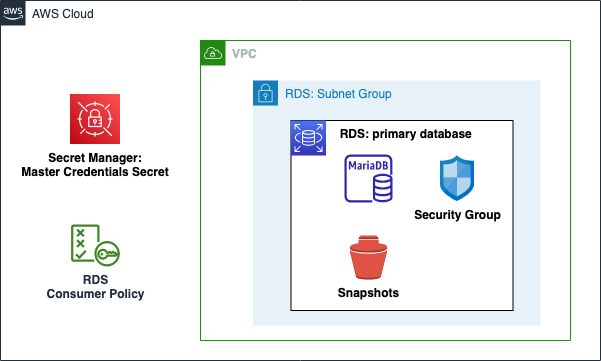

# AWS RDS Database Component

Amazon Relational Database Service (Amazon RDS) is a managed service that makes it easy to set up, operate, and scale a relational database in the cloud. It provides cost-efficient and resizable capacity while automating time-consuming administration tasks such as hardware provisioning, database setup, patching, and backups.

This module creates:

- **RDS Database Instance**: An RDS instance hosting the RDS database.
- **RDS Security Group**: A security group for the RDS database.
- **RDS Database Subnet Group**: A subnet group for the RDS database, representing the subnets in which the RDS database can be deployed.
- **Consumer Policy**: A policy that can be added to an IAM role which allows the role to access the RDS database.
- **Managed Master Password Secret**: Optional, An AWS Secrets Manager secret containing the master password for the RDS database.

## Architecture



## Implementation decisions

### RDS Security Group

The RDS security group is created with the following rules:

- Inbound: Allow traffic from the RDS security group (itself) on all protocols and ports.
- Inbound: Allow traffic from any user-specified security group on TCP protocol and the port of the RDS instance, e.g., allowing an EC2 security accessing the RDS database on port 3306.
- Outbound: Allow all protocols and ports outbound.

### RDS Database Subnet Group

The RDS database subnet group is created with the user-specified subnets.

### Consumer Policy

The consumer policy is a policy that can be added to an external IAM role which allows the role to access the RDS database. The policy is created with the following permissions:

- Allow any user-specified RDS actions on the created RDS database.
- Allow getting the secret value of the RDS database master password.

### Maintenance Window and Backups

The RDS database instance is created with the following configurations:

- Maintenance window: Every Saturday at 2:00-3:00 AM UTC.
- Allow major version upgrades: false.
- Auto minor version upgrade: true.
- Backup window: Every day at 1:00-2:00 AM UTC.
- Backup retention period: user-specifiable, default 7 days.
- Auutomated backups are not deleted when the RDS instance is deleted.

### RDS Recovery Procedure

This module allows for the recovery of the RDS database instance using recovery from Snapshots. The recovery process is automated and can be done by setting the `recover_instance_from_snapshot` variable to `true` and providing the `snapshot_identifier` of the snapshot to recover from.

**During the RDS Recovery Procedure, Terraform will delete the existing RDS instance and create a new RDS instance from the snapshot.** The RDS recovery procedure will take approx. 15 minutes to complete.

After the recovery process, the RDS instance will have the same security group, subnet group, and consumer policy as the original RDS instance.

Set the `recover_instance_from_snapshot` variable to `false` to disable the RDS recovery procedure to avoid recovering the RDS instance again.

### Performance Insights (Optional)

This module allows for enabling Performance Insights for the RDS database instance using retation period of 7 days. The Performance Insights data is encrypted using default AWS KMS key.

### RDS Database Managed Master Password (Optional)

Users can specify to managed the RDS database master password via the RDS instance. Alternatively, the module can generate a random password for the RDS database master user. The password is stored in AWS Secrets Manager. The consumer policy of the RDS instance allows the consumer to get the secret value of the RDS database master password.

Disabling the managed master password feature of the RDS instance does not implement automatic rotation of the master password. The password must be rotated manually.

However, disabling the managed master password feature allows the user freedom to specify the exact value for the master password for the RDS instance, e.g., no special characters for the password.

The password is encrypted using the default AWS KMS Key.

### RDS Monitoring (optional)

The RDS instance can be configured to send monitoring data to an SNS topic. We defined the following monitoring metrics:
- **RDS Status Change**: The alarm is triggered when the status of the RDS instance changes.
- **High CPU Utilization**: The alarm is triggered when the Average CPU utilization of the RDS instance is greater than 50% for 5 minutes.

## How to use this module

```terraform
module "database" {
  source = "path/to/aws-rds"

  db_instance_info = {
    instance_name     = "testdatabase"
    engine            = "mariadb"
    engine_version    = "10.11.6"
    instance_class    = "db.t3.medium"
    allocated_storage = 100
    port              = 3306
    vpc_id            = module.vpc.vpc_id
    subnet_ids        = module.vpc.private_subnets_ids["database"]
  }

  allowed_actions = [
    "rds:DescribeDBInstances",
    "rds:ListTagsForResource",
  ]

  db_username                     = "dbadmin"
  allow_additional_sg_ingress_ids = [module.webapp.launch_template_sg_id]

  tags = local.tags
}
```

<!-- BEGIN_TF_DOCS -->
## Requirements

| Name | Version |
|------|---------|
| <a name="requirement_terraform"></a> [terraform](#requirement\_terraform) | ~> 1.9.0 |
| <a name="requirement_aws"></a> [aws](#requirement\_aws) | ~> 5.75.0 |
| <a name="requirement_random"></a> [random](#requirement\_random) | ~> 3.6.0 |

## Providers

| Name | Version |
|------|---------|
| <a name="provider_aws"></a> [aws](#provider\_aws) | 5.75.0 |
| <a name="provider_random"></a> [random](#provider\_random) | 3.6.3 |

## Modules

| Name | Source | Version |
|------|--------|---------|
| <a name="module_db_instance_security_group"></a> [db\_instance\_security\_group](#module\_db\_instance\_security\_group) | ../aws-sg | n/a |

## Resources

| Name | Type |
|------|------|
| [aws_cloudwatch_event_rule.cpu_utilization_alarm_rule](https://registry.terraform.io/providers/hashicorp/aws/latest/docs/resources/cloudwatch_event_rule) | resource |
| [aws_cloudwatch_event_rule.rds_status_change_rule](https://registry.terraform.io/providers/hashicorp/aws/latest/docs/resources/cloudwatch_event_rule) | resource |
| [aws_cloudwatch_event_target.cpu_utilization_alarm_target](https://registry.terraform.io/providers/hashicorp/aws/latest/docs/resources/cloudwatch_event_target) | resource |
| [aws_cloudwatch_event_target.rds_status_change_target](https://registry.terraform.io/providers/hashicorp/aws/latest/docs/resources/cloudwatch_event_target) | resource |
| [aws_cloudwatch_metric_alarm.high_cpu_utilization](https://registry.terraform.io/providers/hashicorp/aws/latest/docs/resources/cloudwatch_metric_alarm) | resource |
| [aws_db_instance.database](https://registry.terraform.io/providers/hashicorp/aws/latest/docs/resources/db_instance) | resource |
| [aws_db_subnet_group.main](https://registry.terraform.io/providers/hashicorp/aws/latest/docs/resources/db_subnet_group) | resource |
| [aws_iam_policy.consumer](https://registry.terraform.io/providers/hashicorp/aws/latest/docs/resources/iam_policy) | resource |
| [aws_secretsmanager_secret.master_user_credentials_secret](https://registry.terraform.io/providers/hashicorp/aws/latest/docs/resources/secretsmanager_secret) | resource |
| [aws_secretsmanager_secret_version.master_user_credentials_secret](https://registry.terraform.io/providers/hashicorp/aws/latest/docs/resources/secretsmanager_secret_version) | resource |
| [random_password.master_user_password](https://registry.terraform.io/providers/hashicorp/random/latest/docs/resources/password) | resource |
| [random_string.random_suffix](https://registry.terraform.io/providers/hashicorp/random/latest/docs/resources/string) | resource |
| [aws_iam_policy_document.consumer](https://registry.terraform.io/providers/hashicorp/aws/latest/docs/data-sources/iam_policy_document) | data source |

## Inputs

| Name | Description | Type | Default | Required |
|------|-------------|------|---------|:--------:|
| <a name="input_allow_additional_sg_ingress_ids"></a> [allow\_additional\_sg\_ingress\_ids](#input\_allow\_additional\_sg\_ingress\_ids) | List of additional security group IDs to allow ingress traffic into the RDS instance | `list(string)` | `[]` | no |
| <a name="input_allowed_actions"></a> [allowed\_actions](#input\_allowed\_actions) | List of RDS actions which are allowed for same account principals for the consumer policy | `list(string)` | <pre>[<br/>  "rds:DescribeDBInstances",<br/>  "rds:ListTagsForResource",<br/>  "ec2:DescribeAccountAttributes",<br/>  "ec2:DescribeAvailabilityZones",<br/>  "ec2:DescribeInternetGateways",<br/>  "ec2:DescribeSecurityGroups",<br/>  "ec2:DescribeSubnets",<br/>  "ec2:DescribeVpcAttribute",<br/>  "ec2:DescribeVpcs"<br/>]</pre> | no |
| <a name="input_db_backup_retention_period_days"></a> [db\_backup\_retention\_period\_days](#input\_db\_backup\_retention\_period\_days) | The number of days to retain automated backups for | `number` | `7` | no |
| <a name="input_db_instance_info"></a> [db\_instance\_info](#input\_db\_instance\_info) | Database instance info | <pre>object({<br/>    instance_name     = string<br/>    engine            = string<br/>    engine_version    = string<br/>    instance_class    = string<br/>    allocated_storage = number<br/>    port              = number<br/>    vpc_id            = string<br/>    subnet_ids        = list(string)<br/>  })</pre> | <pre>{<br/>  "allocated_storage": 100,<br/>  "engine": "mariadb",<br/>  "engine_version": "10.11.6",<br/>  "instance_class": "db.t3.medium",<br/>  "instance_name": "testinstance",<br/>  "port": 3306,<br/>  "subnet_ids": [<br/>    "subnet-123",<br/>    "subnet-456"<br/>  ],<br/>  "vpc_id": "vpc-123"<br/>}</pre> | no |
| <a name="input_db_username"></a> [db\_username](#input\_db\_username) | The master username for the database | `string` | `"dbadmin"` | no |
| <a name="input_enable_monitoring"></a> [enable\_monitoring](#input\_enable\_monitoring) | Enable monitoring for the RDS instance | `bool` | `false` | no |
| <a name="input_enable_performance_insights"></a> [enable\_performance\_insights](#input\_enable\_performance\_insights) | Whether to enable Performance Insights for the RDS instance | `bool` | `false` | no |
| <a name="input_manage_master_user_password"></a> [manage\_master\_user\_password](#input\_manage\_master\_user\_password) | Whether to manage the master user password. If set to false, a random password will be generated and stored in Secrets Manager | `bool` | `true` | no |
| <a name="input_monitoring_sns_topic_arn"></a> [monitoring\_sns\_topic\_arn](#input\_monitoring\_sns\_topic\_arn) | The ARN of the SNS topic to which the monitoring for the RDS instance will be sent | `string` | `""` | no |
| <a name="input_recover_instance_from_snapshot"></a> [recover\_instance\_from\_snapshot](#input\_recover\_instance\_from\_snapshot) | Whether to create the RDS instance from a snapshot | `bool` | `false` | no |
| <a name="input_snapshot_identifier"></a> [snapshot\_identifier](#input\_snapshot\_identifier) | The snapshot identifier to create the RDS instance from | `string` | `""` | no |
| <a name="input_tags"></a> [tags](#input\_tags) | Custom tags which can be passed on to the AWS resources. They should be key value pairs having distinct keys. | `map(any)` | `{}` | no |

## Outputs

| Name | Description |
|------|-------------|
| <a name="output_consumer_policy_arn"></a> [consumer\_policy\_arn](#output\_consumer\_policy\_arn) | The ARN of the IAM policy for the consumer. |
| <a name="output_master_password_secret_arn"></a> [master\_password\_secret\_arn](#output\_master\_password\_secret\_arn) | The ARN of the secret containing the master user password for the RDS instance. |
| <a name="output_rds_address"></a> [rds\_address](#output\_rds\_address) | The address or endpoint of the RDS instance. |
| <a name="output_rds_arn"></a> [rds\_arn](#output\_rds\_arn) | The ARN of the RDS instance. |
| <a name="output_rds_name"></a> [rds\_name](#output\_rds\_name) | The name of the RDS instance. |
| <a name="output_rds_port"></a> [rds\_port](#output\_rds\_port) | The port on which the RDS instance is listening. |
<!-- END_TF_DOCS -->
