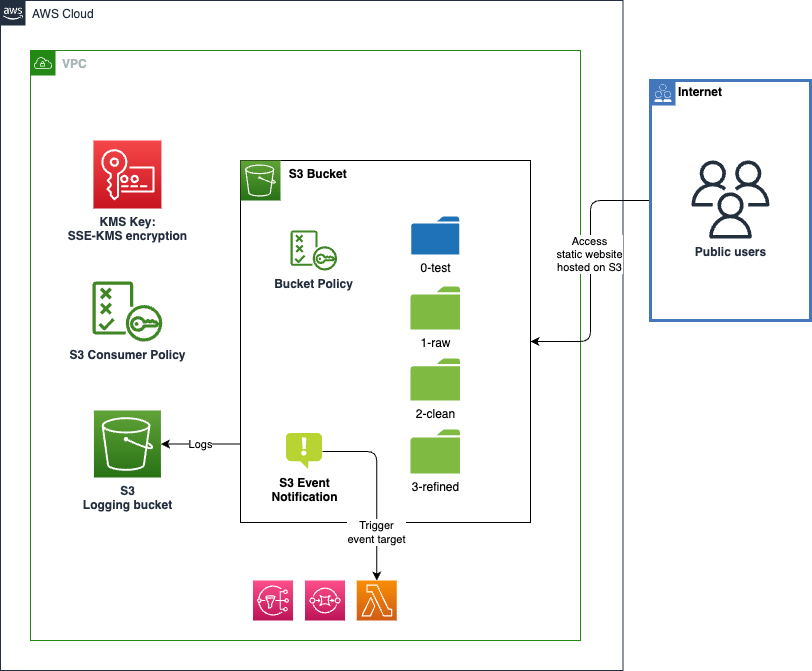

# AWS S3 Bucket

Amazon Simple Storage Service (Amazon S3) is an object storage service that offers industry-leading scalability, data availability, security, and performance. This component creates an encrypted S3 bucket that is "closed by default" and has security policies configured.

This module creates:

- **S3 bucket**
- **S3 folder structure**: Optional, empty folders to be created in the bucket.
- **S3 bucket policy**: Optional, a bucket policy to allow public reads if the bucket is configured to host a static website. Otherwise, users can provide a custom bucket policy.
- **S3 consumer policy**: This policy is created for the consumers of S3 bucket. It can be directly attached to all the consumers which will give them required permissions to access this bucket. *We do not recommend consumers creating s3 bucket access policy on their own*.
- **KMS key**: Optional, Server side encryption using KMS key. Users cannot upload data to S3 without this KMS key, enforced using bucket policies.
- **S3 Logging Bucket**: Optional, A dedicated S3 bucket to capture server access logs of the primary S3 bucket.
- **S3 Event Notification**: Optional, S3 bucket notifications to send messages to other AWS services when objects are created in the bucket.
- **S3 Static Website Hosting**: Optional, S3 bucket configured to host a static website.

## Architecture



## Implementation decisions

### Folder structure

The S3 bucket can be configured with predefined folder structures. This can be specified using a Terraform variables.

Predefined folders are dedicated to store STAC Catalogs. We wrote a dedicated tutorial to instruct how to create STAC catalogues and host it in S3 buckets.

### SSE-S3 and SSE-KMS

By default, the bucket is encrypted using SSE-S3. The bucket encryption can be enforced to use SSE-KMS. The KMS key used for SSE-KMS is created together with this module.

### Server access logging (optional)

There are two types of S3 logging:
- Logging Amazon S3 API calls using AWS CloudTrail.
- Logging requests using server access logging.

For more info, see the [AWS User Guide](https://docs.aws.amazon.com/AmazonS3/latest/userguide/logging-with-S3.html).

Our S3 bucket will send its service access logs to a second S3 logging bucket. This can be disabled using a Terraform variable.

### Bucket Notification (optional)

Bucket notifications can be configured to send messages to other AWS services when objects are created in the bucket. This can be configured using the `aws_s3_bucket_notification` resource.

Users can configure the bucket to send notifications to an SNS topic, SQS queue, or Lambda function by providing the ARN of the target resource.

Users can provide the S3 bucket notification events as a list of strings and filter rules (prefix and suffix) as strings.

**Currently, different types of events and filter rules per target resource are not supported. In other words, all target resources will trigger on the same S3 notification events and filter rules.**

### Public Bucket Access (optional)

The S3 bucket can be configured to public access enabled. When enabled, the bucket will be configured to allow public access to all assets within the bucket. The following changes will be applied to the bucket:
- Public access will block for the bucket will be disabled.
- The bucket policy will be updated to allow anonympus public read access to the bucket. Note: the bucket policy must be enabled by the Terraform variable.

> **Remark**: The bucket policy will allow public read access to all objects in the bucket. If you do not want to allow public read access to all objects in the bucket, you can disable the static website hosting feature.

### Static website hosting (optional)

The S3 bucket can be configured to host a static website. When enabled, the bucket will be configured to serve static website content using the index.html file in the root of the bucket. The following changes will be applied to the bucket:
- Public access will block for the bucket will be disabled.
- The bucket policy will be updated to allow anonympus public read access to the bucket. Note: the bucket policy must be enabled by the Terraform variable.
- The bucket website configuration will be updated to serve the index.html file as the default document.

> **Remark**: The bucket policy will allow public read access to all objects in the bucket. This is required for the static website to be accessible to the public. If you do not want to allow public read access to all objects in the bucket, you can disable the static website hosting feature.

### Bucket Policy (optional)

We enforced a bucket policy on the S3 bucket to allow public reads if the bucket is configured to host a static website. Otherwise, we allow the user to override the bucket policy with a custom policy.

## How to use this module

```terraform
module "bucket" {
  source = "./local/path/to/this/module"

  bucket_name          = "my-bucket"
  append_random_suffix = true
  force_s3_destroy     = false
  versioning_enabled   = true
  server_access_logging_enabled = true

  apply_bucket_policy    = true
  enabled_kms_encryption = false

  folder_names = ["folder1", "folder2"]

  allowed_actions = [
    "s3:GetObject",
    "s3:PutObject",
    "s3:ListBucket"
  ]

  enable_bucket_notification = true
  bucket_notification_info = {
    events               = ["s3:ObjectCreated:*"]
    filter_prefix        = ""
    filter_suffix        = ""
    lambda_function_arns = [module.clean_lambda.lambda_info.arn]
    sqs_queue_arns       = []
    sns_topic_arns       = []
  }

  bucket_kms_allow_additional_principals = []

  enable_public_access          = false
  enable_static_website_hosting = false

  tags = var.tags
}
```

<!-- BEGIN_TF_DOCS -->
## Requirements

| Name | Version |
|------|---------|
| <a name="requirement_terraform"></a> [terraform](#requirement\_terraform) | ~> 1.9.0 |
| <a name="requirement_aws"></a> [aws](#requirement\_aws) | ~> 5.75.0 |
| <a name="requirement_random"></a> [random](#requirement\_random) | ~> 3.6.0 |

## Providers

| Name | Version |
|------|---------|
| <a name="provider_aws"></a> [aws](#provider\_aws) | 5.75.0 |
| <a name="provider_random"></a> [random](#provider\_random) | 3.6.3 |

## Modules

| Name | Source | Version |
|------|--------|---------|
| <a name="module_bucket_kms_key"></a> [bucket\_kms\_key](#module\_bucket\_kms\_key) | ../aws-kmskey | n/a |

## Resources

| Name | Type |
|------|------|
| [aws_iam_policy.consumer](https://registry.terraform.io/providers/hashicorp/aws/latest/docs/resources/iam_policy) | resource |
| [aws_s3_bucket.bucket](https://registry.terraform.io/providers/hashicorp/aws/latest/docs/resources/s3_bucket) | resource |
| [aws_s3_bucket.log_bucket](https://registry.terraform.io/providers/hashicorp/aws/latest/docs/resources/s3_bucket) | resource |
| [aws_s3_bucket_logging.bucket_logging_link](https://registry.terraform.io/providers/hashicorp/aws/latest/docs/resources/s3_bucket_logging) | resource |
| [aws_s3_bucket_notification.bucket_notification](https://registry.terraform.io/providers/hashicorp/aws/latest/docs/resources/s3_bucket_notification) | resource |
| [aws_s3_bucket_ownership_controls.bucket](https://registry.terraform.io/providers/hashicorp/aws/latest/docs/resources/s3_bucket_ownership_controls) | resource |
| [aws_s3_bucket_ownership_controls.log_bucket](https://registry.terraform.io/providers/hashicorp/aws/latest/docs/resources/s3_bucket_ownership_controls) | resource |
| [aws_s3_bucket_policy.policy](https://registry.terraform.io/providers/hashicorp/aws/latest/docs/resources/s3_bucket_policy) | resource |
| [aws_s3_bucket_public_access_block.bucket](https://registry.terraform.io/providers/hashicorp/aws/latest/docs/resources/s3_bucket_public_access_block) | resource |
| [aws_s3_bucket_public_access_block.log_bucket](https://registry.terraform.io/providers/hashicorp/aws/latest/docs/resources/s3_bucket_public_access_block) | resource |
| [aws_s3_bucket_server_side_encryption_configuration.sse_encryption](https://registry.terraform.io/providers/hashicorp/aws/latest/docs/resources/s3_bucket_server_side_encryption_configuration) | resource |
| [aws_s3_bucket_versioning.bucket](https://registry.terraform.io/providers/hashicorp/aws/latest/docs/resources/s3_bucket_versioning) | resource |
| [aws_s3_bucket_versioning.log_bucket](https://registry.terraform.io/providers/hashicorp/aws/latest/docs/resources/s3_bucket_versioning) | resource |
| [aws_s3_bucket_website_configuration.bucket](https://registry.terraform.io/providers/hashicorp/aws/latest/docs/resources/s3_bucket_website_configuration) | resource |
| [aws_s3_object.main](https://registry.terraform.io/providers/hashicorp/aws/latest/docs/resources/s3_object) | resource |
| [random_string.random_suffix](https://registry.terraform.io/providers/hashicorp/random/latest/docs/resources/string) | resource |
| [aws_caller_identity.main](https://registry.terraform.io/providers/hashicorp/aws/latest/docs/data-sources/caller_identity) | data source |
| [aws_iam_policy_document.consumer](https://registry.terraform.io/providers/hashicorp/aws/latest/docs/data-sources/iam_policy_document) | data source |
| [aws_iam_policy_document.public_read](https://registry.terraform.io/providers/hashicorp/aws/latest/docs/data-sources/iam_policy_document) | data source |
| [aws_region.active](https://registry.terraform.io/providers/hashicorp/aws/latest/docs/data-sources/region) | data source |

## Inputs

| Name | Description | Type | Default | Required |
|------|-------------|------|---------|:--------:|
| <a name="input_allowed_actions"></a> [allowed\_actions](#input\_allowed\_actions) | List of S3 actions which are allowed for same account principals for the consumer policy | `list(string)` | <pre>[<br/>  "s3:GetObject",<br/>  "s3:PutObject",<br/>  "s3:ListBucket"<br/>]</pre> | no |
| <a name="input_append_random_suffix"></a> [append\_random\_suffix](#input\_append\_random\_suffix) | Append random string as suffix? (true/false) | `bool` | `true` | no |
| <a name="input_apply_bucket_policy"></a> [apply\_bucket\_policy](#input\_apply\_bucket\_policy) | Whether to apply pre-defined bucket policy. | `bool` | `true` | no |
| <a name="input_bucket_kms_allow_additional_principals"></a> [bucket\_kms\_allow\_additional\_principals](#input\_bucket\_kms\_allow\_additional\_principals) | [Optional] Additional Bucket KMS Policy Principals. | `list(string)` | `[]` | no |
| <a name="input_bucket_name"></a> [bucket\_name](#input\_bucket\_name) | The name of the bucket | `string` | n/a | yes |
| <a name="input_bucket_notification_info"></a> [bucket\_notification\_info](#input\_bucket\_notification\_info) | [Optional] Object containing S3 notifications configuration.<br/>Users can configure Lambda functions, SQS queues, and SNS topics as targets<br/>and S3 notification events, prefix, and suffix filters. | <pre>object({<br/>    events               = list(string)<br/>    filter_prefix        = string<br/>    filter_suffix        = string<br/>    lambda_function_arns = list(string)<br/>    sqs_queue_arns       = list(string)<br/>    sns_topic_arns       = list(string)<br/>  })</pre> | <pre>{<br/>  "events": [<br/>    "s3:ObjectCreated:*"<br/>  ],<br/>  "filter_prefix": "",<br/>  "filter_suffix": "",<br/>  "lambda_function_arns": [],<br/>  "sns_topic_arns": [],<br/>  "sqs_queue_arns": []<br/>}</pre> | no |
| <a name="input_bucket_suffix_length"></a> [bucket\_suffix\_length](#input\_bucket\_suffix\_length) | Length of suffix string for bucket name | `number` | `4` | no |
| <a name="input_enable_bucket_notification"></a> [enable\_bucket\_notification](#input\_enable\_bucket\_notification) | Enable S3 bucket notification configuration? (true/false) | `bool` | `false` | no |
| <a name="input_enable_kms_encryption"></a> [enable\_kms\_encryption](#input\_enable\_kms\_encryption) | Enable S3 bucket encryption with KMS key? (true/false) | `bool` | `false` | no |
| <a name="input_enable_public_access"></a> [enable\_public\_access](#input\_enable\_public\_access) | Enable public access to the S3 bucket? (true/false) | `bool` | `false` | no |
| <a name="input_enable_static_website_hosting"></a> [enable\_static\_website\_hosting](#input\_enable\_static\_website\_hosting) | Enable S3 static website hosting? (true/false) | `bool` | `false` | no |
| <a name="input_folder_names"></a> [folder\_names](#input\_folder\_names) | List of folder names to be created in the S3 bucket. Will create .keep file in each folder. Sub-folders are also supported, use S3 standard forward slash as folder separator | `list(string)` | `[]` | no |
| <a name="input_force_s3_destroy"></a> [force\_s3\_destroy](#input\_force\_s3\_destroy) | Force destruction of the S3 bucket when the stack is deleted | `string` | `false` | no |
| <a name="input_full_override_bucket_policy_document"></a> [full\_override\_bucket\_policy\_document](#input\_full\_override\_bucket\_policy\_document) | [Optional] Bucket Policy JSON document. Bucket Policy Statements will be fully overriden | `string` | `"{}"` | no |
| <a name="input_server_access_logging_enabled"></a> [server\_access\_logging\_enabled](#input\_server\_access\_logging\_enabled) | Should server access logging be enabled? (true/false) | `bool` | `false` | no |
| <a name="input_tags"></a> [tags](#input\_tags) | Custom tags which can be passed on to the AWS resources. They should be key value pairs having distinct keys. | `map(any)` | `{}` | no |
| <a name="input_versioning_enabled"></a> [versioning\_enabled](#input\_versioning\_enabled) | Should versioning be enabled? (true/false) | `bool` | `false` | no |

## Outputs

| Name | Description |
|------|-------------|
| <a name="output_bucket_arn"></a> [bucket\_arn](#output\_bucket\_arn) | The Amazon Resource Name (ARN) of the S3 bucket. |
| <a name="output_bucket_domain_name"></a> [bucket\_domain\_name](#output\_bucket\_domain\_name) | The domain name of the S3 bucket. |
| <a name="output_bucket_id"></a> [bucket\_id](#output\_bucket\_id) | The ID of the S3 bucket. |
| <a name="output_bucket_kms_key_arn"></a> [bucket\_kms\_key\_arn](#output\_bucket\_kms\_key\_arn) | The Amazon Resource Name (ARN) of the KMS key used for the S3 bucket. |
| <a name="output_bucket_kms_key_id"></a> [bucket\_kms\_key\_id](#output\_bucket\_kms\_key\_id) | The ID of the KMS key used for the S3 bucket. |
| <a name="output_bucket_name"></a> [bucket\_name](#output\_bucket\_name) | The name of the S3 bucket. |
| <a name="output_consumer_policy_arn"></a> [consumer\_policy\_arn](#output\_consumer\_policy\_arn) | The Amazon Resource Name (ARN) of the IAM policy for the consumer. |
<!-- END_TF_DOCS -->
