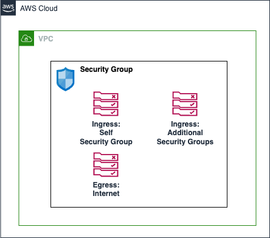

# AWS Security Group

A security group controls the traffic that is allowed to reach and leave the resources that it is associated with. For example, after you associate a security group with an EC2 instance, it controls the inbound and outbound traffic for the instance.

This module creates:

- **Security Group**
- **Security Group Rules**: Inbound and Outbound rules for the security group.

## Architecture



## Implementation decisions

### Security Group Rules

The security group is created with the following rules:
- Inbound: Allow traffic from the EFS security group (itself) on all protocols and ports.
- Inbound: Optional, Allow traffic from the internet on specified protocol and port.
- Inbound: Allow traffic from any user-specified security group on specified protocol and port.
- Outbound: Allow all protocols and ports outbound to internet.

## How to use this module

```terraform
module "my_sg" {
  source = "./local/path/to/this/module"
  service_name               = "my-service"
  security_group_description = "Security group for service: ${var.service_name}"
  vpc_id                     = "vpc-1234567890"

  allow_ingress_internet = false

  allow_additional_sg_ingress_ids = [sg-1234567890, sg-0987654321]
  additional_sg_port              = 443
  additional_sg_protocol          = "tcp"

  tags = var.tags
}
```

<!-- BEGIN_TF_DOCS -->
## Requirements

| Name | Version |
|------|---------|
| <a name="requirement_terraform"></a> [terraform](#requirement\_terraform) | ~> 1.9.0 |
| <a name="requirement_aws"></a> [aws](#requirement\_aws) | ~> 5.75.0 |

## Providers

| Name | Version |
|------|---------|
| <a name="provider_aws"></a> [aws](#provider\_aws) | 5.75.0 |

## Modules

No modules.

## Resources

| Name | Type |
|------|------|
| [aws_security_group.main](https://registry.terraform.io/providers/hashicorp/aws/latest/docs/resources/security_group) | resource |
| [aws_security_group_rule.main_allow_from_sg](https://registry.terraform.io/providers/hashicorp/aws/latest/docs/resources/security_group_rule) | resource |
| [aws_security_group_rule.main_egress_internet](https://registry.terraform.io/providers/hashicorp/aws/latest/docs/resources/security_group_rule) | resource |
| [aws_security_group_rule.main_ingress_allow_internet](https://registry.terraform.io/providers/hashicorp/aws/latest/docs/resources/security_group_rule) | resource |
| [aws_security_group_rule.main_ingress_self](https://registry.terraform.io/providers/hashicorp/aws/latest/docs/resources/security_group_rule) | resource |

## Inputs

| Name | Description | Type | Default | Required |
|------|-------------|------|---------|:--------:|
| <a name="input_additional_sg_port"></a> [additional\_sg\_port](#input\_additional\_sg\_port) | The port to allow in the additional security group | `number` | `0` | no |
| <a name="input_additional_sg_protocol"></a> [additional\_sg\_protocol](#input\_additional\_sg\_protocol) | The protocol to allow in the additional security group | `string` | `"-1"` | no |
| <a name="input_allow_additional_sg_ingress_ids"></a> [allow\_additional\_sg\_ingress\_ids](#input\_allow\_additional\_sg\_ingress\_ids) | List of additional security group IDs to allow ingress from | `list(string)` | `[]` | no |
| <a name="input_allow_ingress_internet"></a> [allow\_ingress\_internet](#input\_allow\_ingress\_internet) | Whether to allow ingress from the internet for the security group | `bool` | `false` | no |
| <a name="input_ingress_internet_port"></a> [ingress\_internet\_port](#input\_ingress\_internet\_port) | The port to allow from the internet | `number` | `0` | no |
| <a name="input_ingress_internet_protocol"></a> [ingress\_internet\_protocol](#input\_ingress\_internet\_protocol) | The protocol to allow from the internet | `string` | `"-1"` | no |
| <a name="input_security_group_description"></a> [security\_group\_description](#input\_security\_group\_description) | The description of the security group | `string` | `""` | no |
| <a name="input_service_name"></a> [service\_name](#input\_service\_name) | The name of the service for which the security group is being created | `string` | n/a | yes |
| <a name="input_tags"></a> [tags](#input\_tags) | Tags which can be passed on to the AWS resources. They should be key value pairs having distinct keys | `map(string)` | `{}` | no |
| <a name="input_vpc_id"></a> [vpc\_id](#input\_vpc\_id) | The VPC ID for the security group | `string` | n/a | yes |

## Outputs

| Name | Description |
|------|-------------|
| <a name="output_security_group_arn"></a> [security\_group\_arn](#output\_security\_group\_arn) | The ARN of the security group |
| <a name="output_security_group_id"></a> [security\_group\_id](#output\_security\_group\_id) | The ID of the security group |
| <a name="output_security_group_name"></a> [security\_group\_name](#output\_security\_group\_name) | The name of the security group |
<!-- END_TF_DOCS -->
