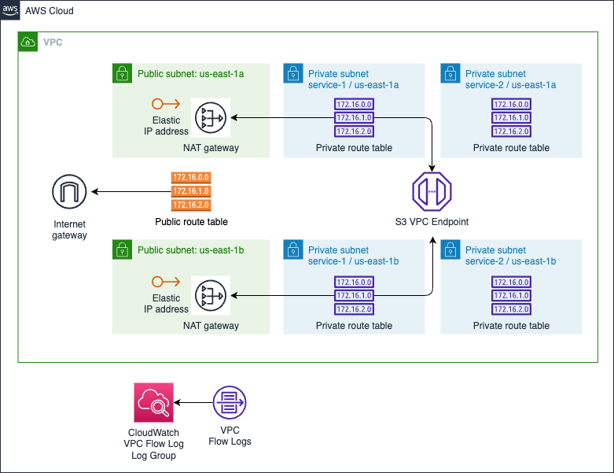

# AWS VPC Component

Amazon Virtual Private Cloud (Amazon VPC) enables you to launch AWS resources into a virtual network that you've defined. This virtual network closely resembles a traditional network that you'd operate in your own data center, with the benefits of using the scalable infrastructure of AWS.

This module creates:

- **VPC and subnets** with public and private subnets
- **VPC Flow Logs**: To capture information about the IP traffic going to and from network interfaces in the VPC, stored in CloudWatch Log Groups.
- **Internet Gateway**: To connect the VPC to the internet
- **NAT Gateway**: [Optional] To allow instances in private subnets to connect to the internet
- **Elastic IP**: [Optional] To assign to NAT Gateway
- **Route Tables**: To route traffic between the VPC and the internet
- **VPC Endpoints for S3**: [Optional] To connect to S3 within private subnets without going through the internet

## Architecture



## Implementation decisions

### VPC and Subnets

This module creates a VPC with one public subnet and multiple private subnet layers associated to multiple tiers. For example, in a typical web application, you might have a public subnet for the load balancer and private subnets for the application servers, database servers, and cache servers, which has its own service tier.

The public subnets are associated with a single shared route table that routes traffic to the internet gateway.

For each service specified by the user, private subnets are deployed to different availability zones. Each private subnet is associated with a dedicated route table that routes traffic to the NAT Gateway if the service is public facing and to the S3 VPC endpoint if the service need to route traffic to S3 privately.

### VPC Flow Logs

This module enables VPC Flow Logs to capture information about the IP traffic going to and from network interfaces in the VPC. The logs are stored in CloudWatch Log Groups.

We create a IAM role with the necessary permissions to publish logs to CloudWatch. The role is attached to the VPC Flow Logs Configuration.

### Multi-AZ NAT Gateway

You can optionally enable a multi-AZ NAT Gateway to provide high availability for instances in private subnets. This is useful for scenarios where you want to ensure that instances in private subnets can connect to the internet even if one of the NAT Gateways fails.

If you disable the multi-AZ NAT Gateway, the module will deploy a single NAT Gateway in the first availability zone in of the public subnet.

### S3 VPC Endpoint

You can optionally enable an S3 VPC endpoint to allow instances in private subnets to connect to S3 without going through the internet. This is useful for scenarios where you want to restrict access to S3 to only instances within the VPC.

## How to use this module

```terraform
module "vpc" {
  source = "../terraform-components/aws-vpc"

  vpc_name                  = "testvpc"
  vpc_cidr_block            = "10.1.0.0/16"
  public_subnet_cidr_blocks = ["10.1.0.0/20", "10.1.16.0/20"]
  private_subnet_info = [
    {
      tier_name               = "application"
      cidr_blocks             = ["10.1.128.0/20", "10.1.144.0/20"]
      availability_zones      = ["us-east-1a", "us-east-1b"]
      public_facing           = true
      connect_s3_vpc_endpoint = true
    },
    {
      tier_name               = "database"
      cidr_blocks             = ["10.1.160.0/20", "10.1.176.0/20"]
      availability_zones      = ["us-east-1a", "us-east-1b"]
      public_facing           = false
      connect_s3_vpc_endpoint = false
    }
  ]

  enable_s3_endpoint = true

  enable_nat_gateway         = true
  enable_multiaz_nat_gateway = true

  tags = local.tags
}
```

<!-- BEGIN_TF_DOCS -->
## Requirements

| Name | Version |
|------|---------|
| <a name="requirement_terraform"></a> [terraform](#requirement\_terraform) | ~> 1.9.0 |
| <a name="requirement_aws"></a> [aws](#requirement\_aws) | ~> 5.75.0 |

## Providers

| Name | Version |
|------|---------|
| <a name="provider_aws"></a> [aws](#provider\_aws) | 5.75.0 |

## Modules

No modules.

## Resources

| Name | Type |
|------|------|
| [aws_cloudwatch_log_group.vpc_flow_log](https://registry.terraform.io/providers/hashicorp/aws/latest/docs/resources/cloudwatch_log_group) | resource |
| [aws_eip.nat](https://registry.terraform.io/providers/hashicorp/aws/latest/docs/resources/eip) | resource |
| [aws_flow_log.vpc_flow_log](https://registry.terraform.io/providers/hashicorp/aws/latest/docs/resources/flow_log) | resource |
| [aws_iam_role.vpc_flow_log](https://registry.terraform.io/providers/hashicorp/aws/latest/docs/resources/iam_role) | resource |
| [aws_iam_role_policy.vpc_flow_log_policy](https://registry.terraform.io/providers/hashicorp/aws/latest/docs/resources/iam_role_policy) | resource |
| [aws_internet_gateway.main](https://registry.terraform.io/providers/hashicorp/aws/latest/docs/resources/internet_gateway) | resource |
| [aws_nat_gateway.main](https://registry.terraform.io/providers/hashicorp/aws/latest/docs/resources/nat_gateway) | resource |
| [aws_route.nat_gateway](https://registry.terraform.io/providers/hashicorp/aws/latest/docs/resources/route) | resource |
| [aws_route_table.private](https://registry.terraform.io/providers/hashicorp/aws/latest/docs/resources/route_table) | resource |
| [aws_route_table.public](https://registry.terraform.io/providers/hashicorp/aws/latest/docs/resources/route_table) | resource |
| [aws_route_table_association.private](https://registry.terraform.io/providers/hashicorp/aws/latest/docs/resources/route_table_association) | resource |
| [aws_route_table_association.public](https://registry.terraform.io/providers/hashicorp/aws/latest/docs/resources/route_table_association) | resource |
| [aws_subnet.private](https://registry.terraform.io/providers/hashicorp/aws/latest/docs/resources/subnet) | resource |
| [aws_subnet.public](https://registry.terraform.io/providers/hashicorp/aws/latest/docs/resources/subnet) | resource |
| [aws_vpc.main](https://registry.terraform.io/providers/hashicorp/aws/latest/docs/resources/vpc) | resource |
| [aws_vpc_endpoint.s3](https://registry.terraform.io/providers/hashicorp/aws/latest/docs/resources/vpc_endpoint) | resource |
| [aws_vpc_endpoint_route_table_association.s3](https://registry.terraform.io/providers/hashicorp/aws/latest/docs/resources/vpc_endpoint_route_table_association) | resource |
| [aws_availability_zones.available](https://registry.terraform.io/providers/hashicorp/aws/latest/docs/data-sources/availability_zones) | data source |
| [aws_iam_policy_document.vpc_flow_log_assume_role](https://registry.terraform.io/providers/hashicorp/aws/latest/docs/data-sources/iam_policy_document) | data source |
| [aws_iam_policy_document.vpc_flow_log_policy](https://registry.terraform.io/providers/hashicorp/aws/latest/docs/data-sources/iam_policy_document) | data source |
| [aws_region.current](https://registry.terraform.io/providers/hashicorp/aws/latest/docs/data-sources/region) | data source |

## Inputs

| Name | Description | Type | Default | Required |
|------|-------------|------|---------|:--------:|
| <a name="input_enable_multiaz_nat_gateway"></a> [enable\_multiaz\_nat\_gateway](#input\_enable\_multiaz\_nat\_gateway) | Enable Multi-AZ NAT Gateway | `bool` | `false` | no |
| <a name="input_enable_nat_gateway"></a> [enable\_nat\_gateway](#input\_enable\_nat\_gateway) | Enable NAT Gateway | `bool` | `false` | no |
| <a name="input_enable_s3_endpoint"></a> [enable\_s3\_endpoint](#input\_enable\_s3\_endpoint) | Enable S3 VPC endpoint | `bool` | `true` | no |
| <a name="input_public_subnet_cidr_blocks"></a> [public\_subnet\_cidr\_blocks](#input\_public\_subnet\_cidr\_blocks) | The CIDR blocks for the public subnets | `list(string)` | <pre>[<br/>  "10.0.0.0/20",<br/>  "10.0.16.0/20"<br/>]</pre> | no |
| <a name="input_tags"></a> [tags](#input\_tags) | Custom tags which can be passed on to the AWS resources. They should be key value pairs having distinct keys. | `map(any)` | `{}` | no |
| <a name="input_tier_info"></a> [tier\_info](#input\_tier\_info) | The info blocks for the private subnet structure for the tiers to deploy.<br/>Each block respresents a tier should have tier\_name, cidr\_blocks, availability\_zones, public\_facing,<br/>connect\_s3\_vpc\_endpoint. | <pre>list(object({<br/>    tier_name               = string<br/>    cidr_blocks             = list(string)<br/>    availability_zones      = list(string)<br/>    public_facing           = bool<br/>    connect_s3_vpc_endpoint = bool<br/><br/>  }))</pre> | <pre>[<br/>  {<br/>    "availability_zones": [<br/>      "us-east-1a",<br/>      "us-east-1b"<br/>    ],<br/>    "cidr_blocks": [<br/>      "10.0.128.0/20",<br/>      "10.0.144.0/20"<br/>    ],<br/>    "connect_s3_vpc_endpoint": true,<br/>    "public_facing": true,<br/>    "tier_name": "application"<br/>  },<br/>  {<br/>    "availability_zones": [<br/>      "us-east-1a",<br/>      "us-east-1b"<br/>    ],<br/>    "cidr_blocks": [<br/>      "10.0.160.0/20",<br/>      "10.0.172.0/20"<br/>    ],<br/>    "connect_s3_vpc_endpoint": false,<br/>    "public_facing": false,<br/>    "tier_name": "database"<br/>  }<br/>]</pre> | no |
| <a name="input_vpc_cidr_block"></a> [vpc\_cidr\_block](#input\_vpc\_cidr\_block) | The CIDR block for the VPC | `string` | `"10.0.0.0/16"` | no |
| <a name="input_vpc_name"></a> [vpc\_name](#input\_vpc\_name) | The name of the vpc | `string` | n/a | yes |

## Outputs

| Name | Description |
|------|-------------|
| <a name="output_private_subnets_ids"></a> [private\_subnets\_ids](#output\_private\_subnets\_ids) | The IDs of the deployed private subnets, identified by the tier name. |
| <a name="output_public_subnets_ids"></a> [public\_subnets\_ids](#output\_public\_subnets\_ids) | The IDs of the deployed public subnets |
| <a name="output_vpc_default_security_group_id"></a> [vpc\_default\_security\_group\_id](#output\_vpc\_default\_security\_group\_id) | The ID of the default security group of the deployed VPC |
| <a name="output_vpc_id"></a> [vpc\_id](#output\_vpc\_id) | The ID of the deployed VPC |
<!-- END_TF_DOCS -->
